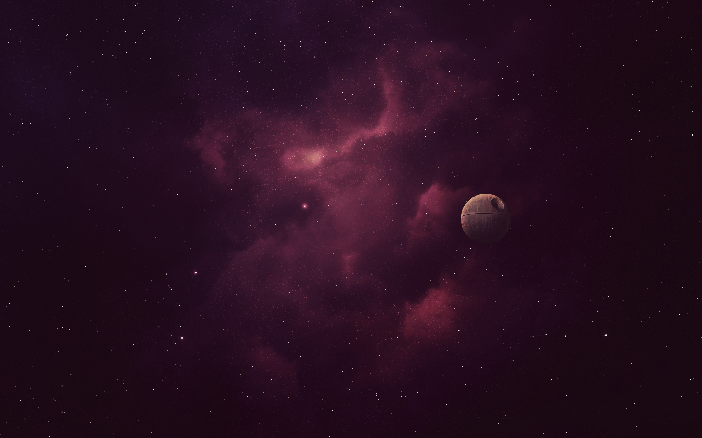
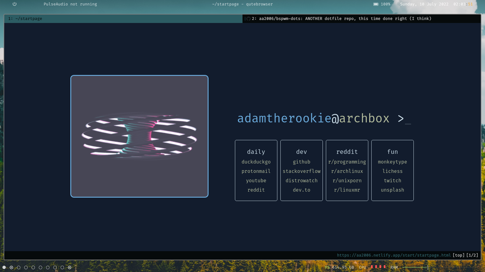
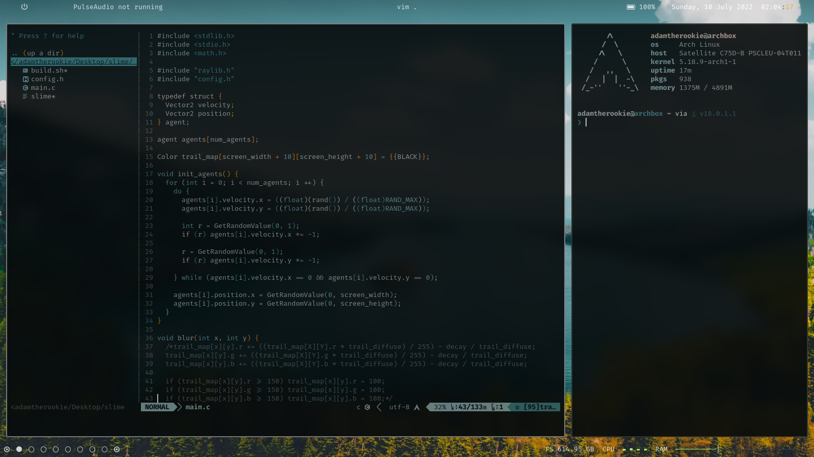
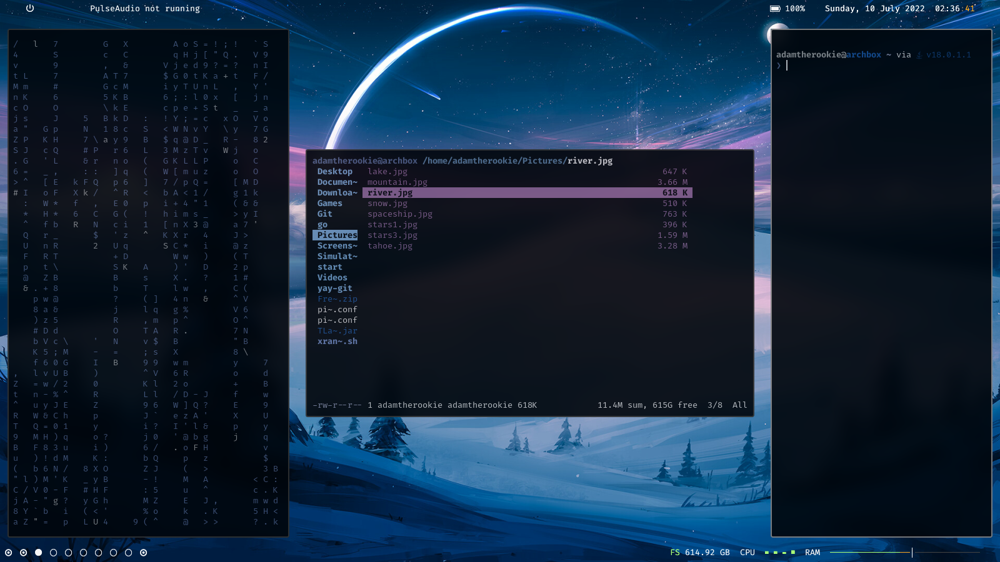

# My bspwm dotfiles

(I know my vim config is kinda bloated but I like it that way :/)

## Contains:
- bspwm config
- sxhkd config
- polybar config
- picom config
- qutebrowser config
- dunst config

- Requires a Nerd Font to be installed (I use Fira Code)
- This is a pywal config so everything is theme-able using pywal
- The start page can be found on my [website](https://aa2006.netlify.app/start/startpage.html). The repo is [here](https://github.com/aa2006/website) (Based on [this](https://github.com/kencx/startpage) repo).

## Wallpapers
I've gathered a collection of wallpapers from all around the internet so really can't give credits :/

## Screenshots

